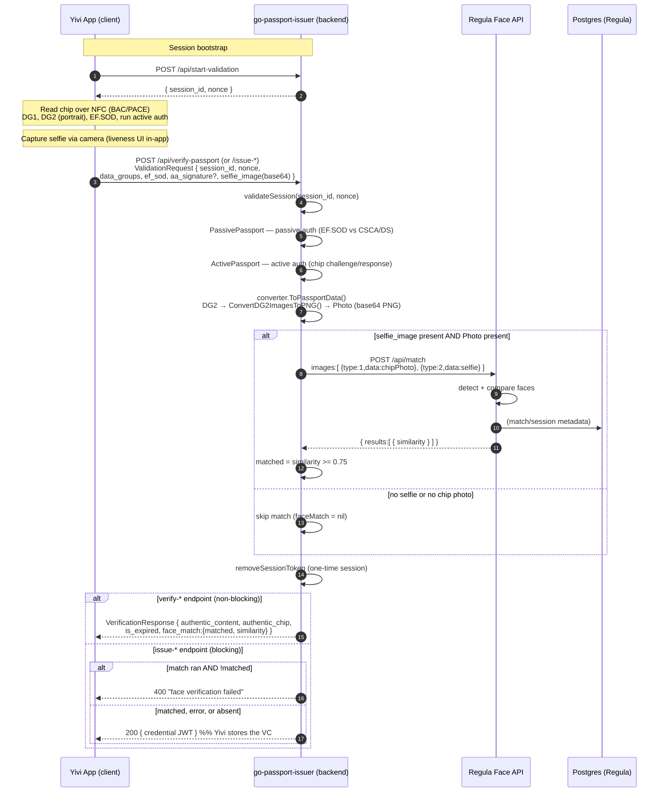
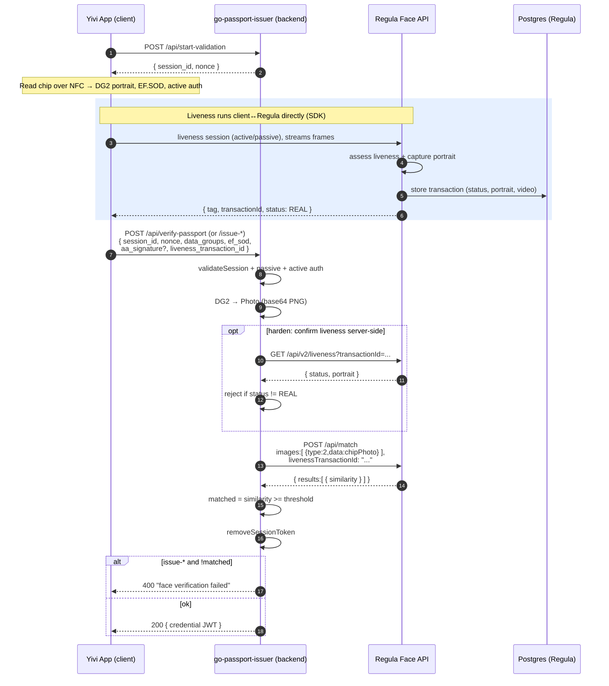
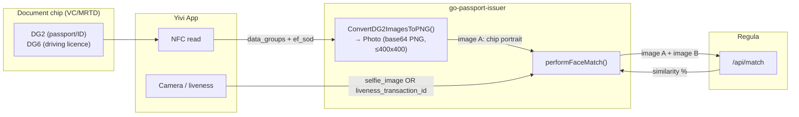

# Face Verification Design — Regula ↔ Passport Issuer ↔ VC/MRTD ↔ Yivi

Status: design / review (branch `feature/face-verification-liveness`)
Scope: how the **Regula Face SDK** service interacts with the **go-passport-issuer** backend, the **VC/MRTD** chip data (DG2/DG6 portrait), and the **Yivi App** on the client, for face matching and liveness.

---

## 1. Purpose

We want to bind the person physically present (a live selfie) to the identity in the
electronic travel/ID document. The document already proves *authenticity* of the data
(passive auth) and *genuineness* of the chip (active auth). Face verification adds
*"the holder is the person in the document"* by comparing:

- the **portrait stored in the chip** (DG2 for passports/ID cards, DG6 for driving
  licences), read over NFC by the Yivi client; against
- a **live capture** of the person's face taken by the Yivi client's camera.

Regula performs the 1:1 comparison (and, optionally, a liveness assessment). The
backend orchestrates it and gates credential issuance on the result.

---

## 2. Components & responsibilities

| Component | Role |
|---|---|
| **Yivi App (client)** | Reads the chip over NFC (BAC/PACE), collects DG1/DG2/…/EF.SOD, captures the live selfie / runs the liveness UI, and calls the issuer API. Later receives the issued verifiable credential. |
| **go-passport-issuer (backend)** | Session/nonce management, passive + active authentication of the chip, decoding DG2/DG6 → PNG portrait, orchestrating the face match against Regula, gating issuance, minting the credential. |
| **Regula Face SDK API** (`regulaforensics/face-api`, port `41101`) | Face detection & quality, **1:1 match** (`/api/match`), **liveness** (`/api/v2/liveness`), health (`/api/healthz`). Auth via a mounted license file — no HTTP API key. |
| **PostgreSQL** | Regula-side store for liveness session metadata (transaction IDs, results, portraits). |
| **VC/MRTD** | Not a network service — it is the **document chip data model**. In this repo the term maps to the `Vcmrtd` client page and the chip `DataGroups` + `EF.SOD` the client submits. DG2/DG6 is the face source. |

Config: backend reads `regula_face_api_url` from `local-secrets/config.json`. If unset,
face verification is **silently disabled** (the client factory is nil and matches are skipped).

---

## 3. Regula API surface (from the OpenAPI spec)

Reference: <https://dev.regulaforensics.com/FaceSDK-web-openapi/> (spec v7.2.0).

| Endpoint | Method | Used today? | Purpose |
|---|---|---|---|
| `/api/match` | POST | ✅ yes | 1:1 face comparison. Body = `images[]` each `{index, type, data(base64)}`; **or** pass a `livenessTransactionId` in place of one image. Returns `results[].similarity` (%) and `score`. |
| `/api/v2/liveness` | GET | ❌ not yet | Retrieve a liveness transaction by `transactionId`: `status` (0 confirmed / 1 not), `portrait`, `video`, `age`. |
| `/api/v2/liveness` | DELETE | ❌ | Delete a liveness transaction (GDPR / cleanup). |
| `/api/detect` | POST | ❌ | Face detection + image-quality assessment. |
| `/api/healthz` | GET | ✅ yes | Liveness/readiness probe (backend calls at startup). |

### `ImageSource` enum (the `type` field on match images)

| Value | Name | Meaning |
|---|---|---|
| 1 | `DOCUMENT_PRINTED` | Portrait from the printed/visual document (VIZ). |
| 2 | `DOCUMENT_RFID` | Portrait read from the **chip** (DG2/DG6) — this is our chip portrait. |
| 3 | `LIVE` | A **live** capture / selfie. |
| 4 | `DOCUMENT_WITH_LIVE` | — |
| 5 | `EXTERNAL` | — |

> ⚠️ **Type-tag mismatch in the current code.** `face_verification_client.go` sends the
> chip portrait as `type: 1` (`DOCUMENT_PRINTED`) and the selfie as `type: 2`
> (`DOCUMENT_RFID`). Semantically these should be `type: 2` (chip) and `type: 3` (live).
> The `type` field is optional and only influences internal scoring/quality heuristics,
> so matching still works — but the labels are wrong and should be corrected.

---

## 4. Sequence — current implementation (this PR)

This is what the code on `feature/face-verification-liveness` actually does: the Yivi
client captures a **static selfie** and submits it as base64 alongside the chip data.
Liveness is assumed to be handled in the client UI but is **not** cryptographically
tied to the match on the backend.

Key behaviours worth noting:

- **Non-blocking on `verify-*`:** a Regula error is logged, not fatal — the response
  still returns; `face_match` is simply omitted/false.
- **Blocking on `issue-*`:** `verifyFaceBeforeIssuance` returns HTTP 400 only when a
  match actually ran and came back below threshold. If either image is missing, or if
  Regula errors, issuance **proceeds** (fail-open). This is a deliberate but important
  security trade-off — see §7.
- **Threshold** `0.75` is hardcoded in `face_verification_client.go` (the comment marks
  it as "can be made configurable").

---

## 5. Sequence — recommended flow with liveness transaction

Regula's intended anti-spoofing pattern is: the **client SDK runs the liveness session**
directly against the Face API, which returns a `transactionId` bound to a proven-live,
server-stored portrait. The backend then calls `/api/match` with that
`livenessTransactionId` **instead of** a raw selfie. This closes the "photo of a photo"
gap because the live capture is validated and held server-side, not supplied as an
opaque blob by the client.

Difference from §4: the second match input is a **`livenessTransactionId`** (proven live,
server-held) rather than a client-supplied base64 selfie. The optional
`GET /api/v2/liveness` call lets the backend independently confirm the liveness verdict
before trusting the transaction.

---

## 6. Data flow — where the two faces come from

- Chip portrait (image A) is always derived server-side from the authenticated chip
  data — the client cannot forge it, because it is covered by passive auth (EF.SOD hash)
  and the chip is proven genuine by active auth.
- Live face (image B) is the only part the client supplies freely today — which is
  exactly why liveness matters (§7).

---

## 7. Is the selfie required? — analysis & recommendation

**Short answer: yes, a live face input is required for face matching to happen at all —
but *how* it is supplied is the open design decision, and the current "raw selfie" form
is the weaker option.**

- A 1:1 match needs two inputs. Image A (chip portrait) is derived server-side; image B
  must be a live capture from the client. Without it, `performFaceMatch` short-circuits
  and returns no result — on `verify-*` the response simply carries no `face_match`, and
  on `issue-*` issuance **proceeds anyway** (fail-open). So today the selfie is
  *optional at the protocol level* and only enforced when present.

- The current PR sends a **static base64 selfie** (`selfie_image`). This proves nothing
  about liveness — an attacker who obtains a photo of the target (or the DG2 image
  itself) can pass the match. The README claims liveness is done client-side, but the
  backend does **not** consume any liveness proof, so that claim is not enforceable.

Recommendation:

1. **Adopt the `livenessTransactionId` flow (§5)** rather than a raw selfie. It ties the
   match to a Regula-validated live capture and removes the spoofable blob.
2. If a raw selfie must be kept (e.g. Yivi cannot embed the Regula liveness SDK yet),
   treat it as **interim** and document the residual spoofing risk. Consider calling
   `/api/detect` to at least reject low-quality / non-face images.
3. **Decide the fail-open vs fail-closed policy explicitly** for `issue-*`: today a
   Regula outage or a missing selfie lets issuance through. For a credential that
   asserts identity, fail-closed (require a passing match) is usually the right default,
   with a clear feature flag for environments where Regula is not deployed.
4. **Fix the `type` tags** to `2` (chip / `DOCUMENT_RFID`) and `3` (live / `LIVE`).
5. **Make the `0.75` threshold configurable** (per-document-type if needed).

---

## 8. Open issues found during design

- **Config drift:** `local-secrets/config.json` has an unused `face_verification` block
  (`url: :8000`, `verifier_id`, `callback_url: /api/face/callback`, `timeout_seconds`)
  that no Go code reads, and there is no `/api/face/callback` route. The implemented
  design is the synchronous `regula_face_api_url` + `/api/match` path. The leftover block
  looks like an earlier **async-callback** design; it should be removed to avoid the
  impression that face verification is configured when it is not.
- **Silent disable:** if `regula_face_api_url` is empty (the current local config), face
  verification is off and issuance is unaffected — with no visible signal to the client.
- **Health check is advisory:** startup only `slog.Warn`s on a failed `/api/healthz`; the
  server still starts.

---

## 9. References

- Regula Face SDK Web API — <https://dev.regulaforensics.com/FaceSDK-web-openapi/>
- Liveness usage — <https://docs.regulaforensics.com/develop/face-sdk/web-service/development/usage/liveness/>
- Code: `backend/face_verification_client.go`, `backend/server.go`
  (`performFaceMatch`, `verifyFaceBeforeIssuance`), `backend/models/passport_validation_request.go`
  (`selfie_image`), `backend/images/converter.go` (`ConvertDG2ImagesToPNG`).
</content>
</invoke>
