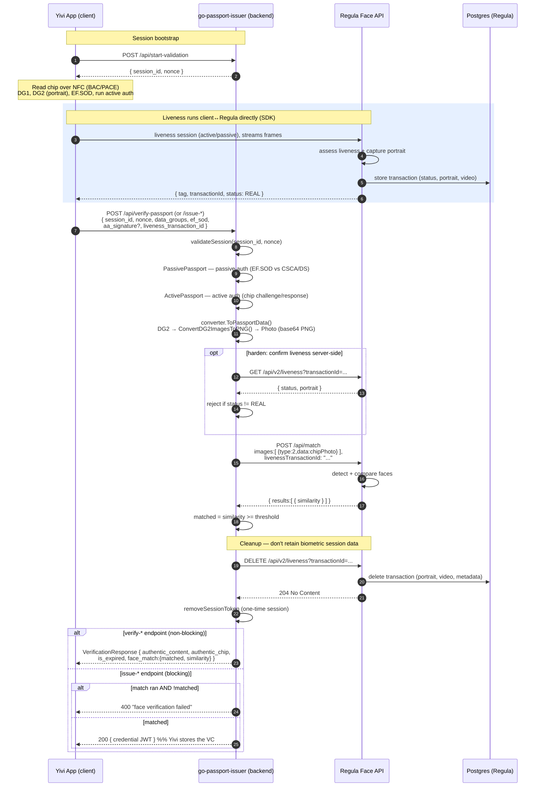
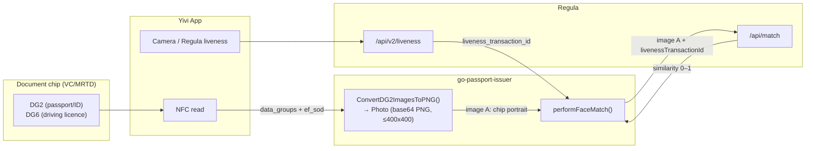

# Face Verification Design — Regula ↔ Passport Issuer ↔ VC/MRTD ↔ Yivi

Status: design / review (branch `feature/face-verification-liveness`)
Scope: how the **Regula Face SDK** service interacts with the **go-passport-issuer** backend, the **VC/MRTD** chip data (DG2/DG6 portrait), and the **Yivi App** on the client, for face matching **with liveness**.

---

## 1. Purpose

We want to bind the person physically present (a proven-live face) to the identity in the
electronic travel/ID document. The document already proves *authenticity* of the data
(passive auth) and *genuineness* of the chip (active auth). Face verification adds
*"the holder is the person in the document"* by comparing:

- the **portrait stored in the chip** (DG2 for passports/ID cards, DG6 for driving
  licences), read over NFC by the Yivi client; against
- a **live capture** of the person's face, validated by Regula liveness.

Regula performs the liveness assessment and the 1:1 comparison. The backend orchestrates
it and gates credential issuance on the result.

---

## 2. Components & responsibilities

| Component | Role |
|---|---|
| **Yivi App (client)** | Reads the chip over NFC (BAC/PACE), collects DG1/DG2/…/EF.SOD, runs the **Regula liveness session** (camera), and calls the issuer API. Later receives the issued verifiable credential. |
| **go-passport-issuer (backend)** | Session/nonce management, passive + active authentication of the chip, decoding DG2/DG6 → PNG portrait, confirming liveness, orchestrating the face match against Regula, gating issuance, minting the credential. |
| **Regula Face SDK API** (`regulaforensics/face-api`, port `41101`) | Face detection & quality, **liveness** (`/api/v2/liveness`), **1:1 match** (`/api/match`), health (`/api/healthz`). Auth via a mounted license file — no HTTP API key. |
| **PostgreSQL** | Regula-side store for liveness session metadata (transaction IDs, results, portraits, video). |
| **VC/MRTD** | Not a network service — it is the **document chip data model**. In this repo the term maps to the `Vcmrtd` client page and the chip `DataGroups` + `EF.SOD` the client submits. DG2/DG6 is the face source. |

Config: backend reads `regula_face_api_url` from `local-secrets/config.json`. If unset,
face verification is **silently disabled** (the client factory is nil and matches are skipped).

---

## 3. Regula API surface (from the OpenAPI spec)

Reference: <https://dev.regulaforensics.com/FaceSDK-web-openapi/> (spec v7.2.0).

| Endpoint | Method | Purpose |
|---|---|---|
| `/api/v2/liveness` | GET | Retrieve a liveness transaction by `transactionId`: `status` (0 confirmed / 1 not), `portrait`, `video`, `age`. |
| `/api/v2/liveness` | DELETE | Delete a liveness transaction by `tag` or `transactionId` (GDPR / retention cleanup). |
| `/api/match` | POST | 1:1 face comparison. Body = `images[]` each `{index, type, data(base64)}`; **or** pass a `livenessTransactionId` in place of one image. Returns `results[].similarity` (0–1 scale) and `score`. |
| `/api/detect` | POST | Face detection + image-quality assessment. |
| `/api/healthz` | GET | Liveness/readiness probe (backend calls at startup). |

### `ImageSource` enum (the `type` field on match images)

| Value | Name | Meaning |
|---|---|---|
| 1 | `DOCUMENT_PRINTED` | Portrait from the printed/visual document (VIZ). |
| 2 | `DOCUMENT_RFID` | Portrait read from the **chip** (DG2/DG6) — this is our chip portrait. |
| 3 | `LIVE` | A **live** capture / selfie. |
| 4 | `DOCUMENT_WITH_LIVE` | — |
| 5 | `EXTERNAL` | — |

`face_verification_client.go` sends the chip portrait as `type: 2` (`DOCUMENT_RFID`,
`regulaImageSourceDocumentRFID`) and the live face as `type: 3` (`LIVE`,
`regulaImageSourceLive`), matching the semantics above.

---

## 4. Sequence — verification / issuance flow with liveness

Regula's anti-spoofing pattern: the **client SDK runs the liveness session** directly
against the Face API, which returns a `transactionId` bound to a proven-live,
server-stored portrait. The backend then calls `/api/match` with that
`livenessTransactionId` **instead of** a raw selfie. This closes the "photo of a photo"
gap because the live capture is validated and held server-side, not supplied as an
opaque blob by the client. After the match, the backend **deletes** the liveness
transaction to satisfy data-retention/GDPR.

Key behaviours worth noting:

- **Second match input is a `livenessTransactionId`** (proven live, server-held), not a
  client-supplied base64 selfie. The optional `GET /api/v2/liveness` lets the backend
  independently confirm the liveness verdict before trusting the transaction.
- **DELETE after match:** the liveness transaction (portrait + video + metadata) is
  removed once the match result is known, so raw biometrics are not retained. If the
  request fails midway, the same `tag`/`transactionId` can be deleted in a cleanup path.
- **Non-blocking on `verify-*`:** a Regula error is logged, not fatal — the response
  still returns; `face_match` is simply omitted/false.
- **Blocking on `issue-*`:** `verifyFaceBeforeIssuance` returns HTTP 400 when a match
  came back below threshold. **Decide the policy** for the missing-liveness / Regula-error
  case explicitly (fail-open vs fail-closed) — see §6.
- **Threshold** `0.75` is hardcoded in `face_verification_client.go` (the comment marks
  it as "can be made configurable"). Regula returns `similarity` on a 0–1 scale, so the
  `similarity >= 0.75` comparison is on the same scale (no percentage conversion needed).

---

## 5. Data flow — where the two faces come from

- Chip portrait (image A) is always derived server-side from the authenticated chip
  data — the client cannot forge it, because it is covered by passive auth (EF.SOD hash)
  and the chip is proven genuine by active auth.
- Live face (image B) is supplied indirectly as a `livenessTransactionId` — the frames
  never pass through the backend as an opaque blob, and Regula has already asserted the
  face is live.

---

## 6. Is the selfie required? — analysis & recommendation

**Yes — a proven-live face input is required for a match to happen, and it should be
supplied as a liveness transaction, not a raw selfie.**

- A 1:1 match needs two inputs. Image A (chip portrait) is derived server-side and is
  tamper-proof (covered by passive/active auth). Image B must come from the client.
  Without it, `performFaceMatch` short-circuits and returns no result — and on `issue-*`
  endpoints issuance currently **proceeds anyway** (fail-open). So today the face input
  is only enforced when present.
- A **static base64 selfie proves nothing about liveness** — a photo of the target (or
  the DG2 image itself) would pass the match. Using the **`livenessTransactionId`** flow
  (§4) ties the match to a Regula-validated live capture and removes the spoofable blob.

Recommendation:

1. **Require the `livenessTransactionId` flow** and confirm the verdict server-side via
   `GET /api/v2/liveness` before trusting it.
2. **Delete the liveness transaction** (`DELETE /api/v2/liveness`) after the match so raw
   biometrics are not retained.
3. **Decide fail-open vs fail-closed explicitly** for `issue-*`: today a Regula outage or
   a missing liveness input lets issuance through. For a credential that asserts identity,
   fail-closed (require a passing match) is usually the right default, with a clear
   feature flag for environments where Regula is not deployed.
4. **Fix the `type` tags** to `2` (chip / `DOCUMENT_RFID`) and `3` (live / `LIVE`).
5. **Make the `0.75` threshold configurable** (per-document-type if needed).

---

## 7. Open issues found during design

- **Config drift:** `local-secrets/config.json` has an unused `face_verification` block
  (`url: :8000`, `verifier_id`, `callback_url: /api/face/callback`, `timeout_seconds`)
  that no Go code reads, and there is no `/api/face/callback` route. The implemented
  design is the synchronous `regula_face_api_url` + `/api/match` path. The leftover block
  looks like an earlier **async-callback** design; it should be removed to avoid the
  impression that face verification is configured when it is not.
- **Silent disable:** if `regula_face_api_url` is empty (the current local config), face
  verification is off and issuance is unaffected — with no visible signal to the client.
- **Health check is advisory:** startup only `slog.Warn`s on a failed `/api/healthz`; the
  server still starts.
- **Match request still sends a raw base64 selfie** today (`selfie_image`) instead of a
  `livenessTransactionId`; migrating to the liveness flow above is the main change this
  design proposes.

---

## 8. References

- Regula Face SDK Web API — <https://dev.regulaforensics.com/FaceSDK-web-openapi/>
- Liveness usage — <https://docs.regulaforensics.com/develop/face-sdk/web-service/development/usage/liveness/>
- Code: `backend/face_verification_client.go`, `backend/server.go`
  (`performFaceMatch`, `verifyFaceBeforeIssuance`), `backend/models/passport_validation_request.go`
  (`selfie_image`), `backend/images/converter.go` (`ConvertDG2ImagesToPNG`).
</content>
