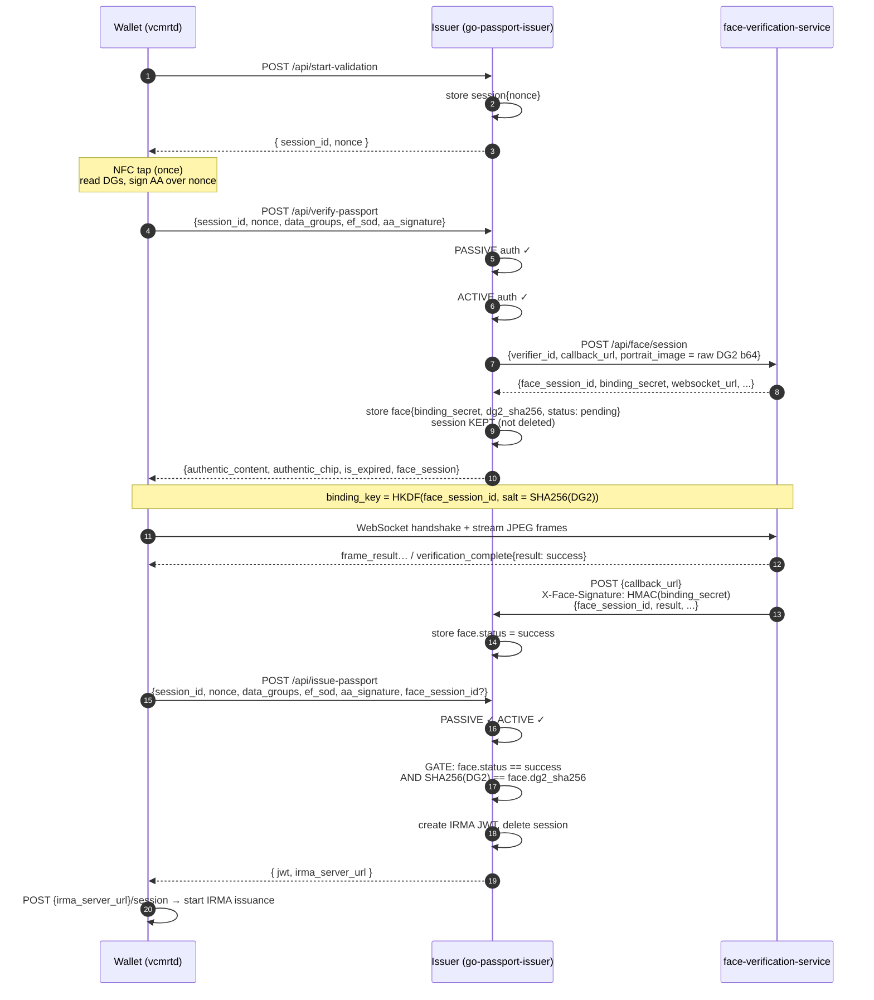
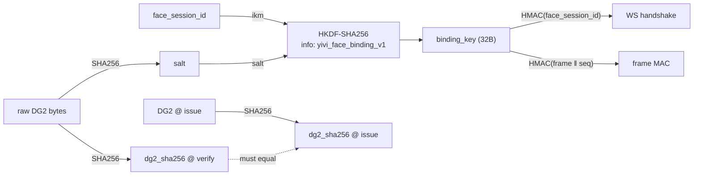

# Passport Issuer — Verification Flow Contracts

> Active/Passive authentication → face verification → gated credential issuance.
> A backwards-compatibility-first proposal.

This document specifies the exact wire contracts for the end-to-end issuance flow
across the three components:

- the wallet (`vcmrtd`),
- the issuer (`go-passport-issuer`),
- the external [`face-verification-service`](https://github.com/privacybydesign/face-verification-service).

**Design goal:** passive + active authentication run **before** the face session,
and a credential is only issued once **both** authentication and face verification
have succeeded — while keeping every wallet-facing request/response schema unchanged.

---

## 1 · End-to-end sequence



Step 4 (verify) is now _optional but recommended_: the face session is created there.
The same single NFC tap (step 2) supplies the AA signature reused by both verify and
issue, so the session must survive from start through issue.

---

## 2 · Design principles

- **No wallet-facing schema breaks.** `start-validation`, `verify-passport` and
  `issue-passport` keep their existing request/response shapes. The only additive
  field is an _optional_ `face_session_id` on issuance requests.
- **Issuer is authoritative.** The face result is never taken from the wallet's
  word. The issuer learns the verdict only from the face service via a
  `binding_secret`-authenticated callback (the secret the README already reserves
  "to authenticate result callbacks").
- **Off-by-default stays byte-for-byte.** When `face_verification.url` is empty,
  issuance is ungated and the whole flow behaves exactly as today.
- **Cryptographic binding to the document.** A face verdict is only honored for
  issuance if its reference photo hash equals `SHA256(DG2)` of the passport being
  issued — a stolen `face_session_id` from another document cannot unlock issuance.
- **One breaking change, scoped & safe:** the session is no longer destroyed by
  `verify-passport`; it lives until `issue-*` consumes it (or its TTL expires).
  No current client depends on verify being terminal.

---

## 3 · Endpoint contracts

### `POST /api/start-validation` — UNCHANGED

| Direction | Body |
|-----------|------|
| Request | _empty_ |
| Response 200 | `{ "session_id": "<32 hex>", "nonce": "<16 hex>" }` |

Creates the session record and the AA nonce. **Behavioral note:** the stored value
gains internal fields (see §4) but the response is identical.

---

### `POST /api/verify-passport` — BEHAVIOR CHANGE (schema unchanged)

Also applies to `/api/verify-driving-licence` (no face session — EDL has no DG2 portrait).

```jsonc
// Request — models.ValidationRequest (unchanged)
{
  "session_id": "a1b2…",
  "nonce": "1234567890abcdef",
  "data_groups": { "DG1": "…hex…", "DG2": "…hex…" },
  "ef_sod": "778201ab…",
  "aa_signature": "304502…"   // optional
}
```

```jsonc
// Response 200 — VerificationResponse (unchanged; face_session already present)
{
  "authentic_content": true,         // passive auth (signature) ok
  "authentic_chip": true,            // active auth (chip challenge) ok
  "is_expired": false,
  "face_session": {                  // omitted when face disabled / no DG2
    "face_session_id": "fs_abc123",
    "face_session_token": "<base64url>",
    "websocket_url": "wss://face.example/stream/fs_abc123",
    "binding_key_ready": true
  }
}
```

**What changes:**

- On success with face enabled + DG2 present, the issuer creates the face session
  and **persists a face record** keyed by `face_session_id` holding
  `{ binding_secret, dg2_sha256, status:"pending", session_id }`.
  `binding_secret` is never returned.
- **The session token is no longer deleted here.** It is consumed by the subsequent
  `issue-*` call (or expires via TTL).
- Face-service failure remains **non-fatal**: verification still returns 200 with no
  `face_session` (unchanged).

---

### `POST {face_verification.callback_url}` — NEW ENDPOINT

Server-to-server: the face service calls this when a session reaches a terminal
verdict. Path is whatever `callback_url` is configured to; suggested route
`/api/face/callback`.

```http
POST /api/face/callback
Content-Type: application/json
X-Face-Signature: base64( HMAC-SHA256( binding_secret, <raw request body> ) )
```

```jsonc
// Request body
{
  "face_session_id": "fs_abc123",
  "result": "success",            // "success" | "failed" | "error"
  "match_confidence": 0.97,        // optional
  "liveness_passed": true,         // optional
  "frames_processed": 42,          // optional
  "completed_at": "2026-06-19T12:00:00Z"
}
```

```jsonc
// Response 200
{ "ok": true }
```

| Status | When |
|--------|------|
| `200` | signature valid & record updated |
| `401` | `X-Face-Signature` missing or HMAC mismatch against the stored `binding_secret` |
| `404` | unknown `face_session_id` |

> **⚠️ External dependency.** The exact callback JSON and signature scheme must match
> [`privacybydesign/face-verification-service`](https://github.com/privacybydesign/face-verification-service)
> (not in this workspace). The body/headers above are the proposed contract derived
> from the streaming protocol (`verification_complete` message fields) and the
> README's "`binding_secret` authenticates result callbacks." Confirm field names &
> the signature header against that repo before implementing.

---

### `POST /api/issue-passport` — GATED + 1 OPTIONAL FIELD

Identical contract for `/api/issue-id-card`, `/api/issue-driving-licence`, and the
legacy `/api/verify-and-issue` alias. (EDL stays ungated — no portrait.)

```jsonc
// Request — ValidationRequest + ONE optional additive field
{
  "session_id": "a1b2…",
  "nonce": "1234567890abcdef",
  "data_groups": { … },
  "ef_sod": "…",
  "aa_signature": "…",
  "face_session_id": "fs_abc123"   // NEW, optional; required only when face enabled
}
```

```jsonc
// Response 200 — IssuanceResponse (unchanged)
{ "jwt": "eyJhbGc…", "irma_server_url": "https://irma.example.com" }
```

**Gate (only when `face_verification.url` is configured):** after passive + active
auth succeed, the issuer additionally requires all of:

1. `face_session_id` present in the request (or resolvable from the session record — see §4 alt).
2. a face record exists for it with `status == "success"`.
3. `SHA256(request.data_groups["DG2"]) == face_record.dg2_sha256` — binds the verdict
   to _this_ document.

| Status | Body | When |
|--------|------|------|
| `200` | `{ jwt, irma_server_url }` | auth ok + (face disabled OR face gate passed) |
| `400` | `invalid request` | bad body / session / nonce / passive / active auth fail (as today) |
| `428` | `face:pending` | face enabled, record exists, callback not yet received → client may retry |
| `403` | `face:required` / `face:failed` / `face:mismatch` | no face_session_id, verdict failed, or DG2 hash mismatch |

On `200` the session token is removed (as today). On the gate failures the session is
left intact so the wallet can retry after the verdict lands.

---

## 4 · Internal session & face state

Two short-lived records in `TokenStorage` (string→string today; values become small
JSON blobs). No interface change required — both are stored/retrieved/removed through
the existing `StoreToken/RetrieveToken/RemoveToken`.

```jsonc
// key: <ns>:token:<session_id>   (was a bare nonce string)
{ "nonce": "1234567890abcdef",
  "face_session_id": "fs_abc123" }   // set by verify-passport (alt to request field)
```

```jsonc
// key: <ns>:face:<face_session_id>   (NEW)
{ "session_id": "a1b2…",
  "binding_secret": "<opaque, never returned>",
  "dg2_sha256": "<hex>",
  "status": "pending",           // pending → success | failed | error
  "match_confidence": null,
  "liveness_passed": null }
```

> **Two correlation options.** _(A, recommended & zero wire change)_: store
> `face_session_id` inside the session record at verify time, so issuance finds the
> verdict from `session_id` alone and the request needs no new field. _(B, explicit)_:
> the wallet passes `face_session_id` on the issue request. Implement A; accept B's
> field as an override. Either way the DG2-hash binding (§3) is the real security check.

> **⚠️ Storage value migration.** Changing the `token` value from a bare nonce to JSON
> is the one internal break. Sessions are short-lived (24h TTL), so a deploy only
> invalidates in-flight sessions. If you must avoid even that, keep nonce bare and
> carry `face_session_id` only on the request (option B).

---

## 5 · Cryptography & binding (already implemented client-side)

| Value | Definition | Who |
|-------|------------|-----|
| reference photo | the **raw DG2 bytes** read from the chip, base64-encoded as `portrait_image` | issuer → face svc |
| `binding_key` | `HKDF-SHA256(ikm=face_session_id, salt=SHA256(reference_photo), info="yivi_face_binding_v1")` | wallet ↔ face svc |
| WS handshake | `HMAC-SHA256(binding_key, face_session_id)` | wallet → face svc |
| frame MAC | `HMAC-SHA256(binding_key, frame_bytes ‖ seq_be64)` | wallet → face svc |
| `binding_secret` | issuer↔face shared secret; authenticates the **callback** (distinct from binding_key) | issuer ↔ face svc |
| issuance binding | `SHA256(DG2)` must match on both the face session (created in verify) and the issue request | issuer-internal |

Because the binding key is salted with `SHA256(raw DG2)`, only the wallet that
physically read the chip can stream against the session — and only that same chip's
portrait can later satisfy the issuance gate.



---

## 6 · Config additions

```jsonc
{
  "face_verification": {
    "url": "https://face.example.com",        // empty ⇒ disabled, flow unchanged
    "verifier_id": "passport-issuer",
    "callback_url": "https://issuer.example.com/api/face/callback",
    "timeout_seconds": 10,
    "require_face_for_issuance": true    // NEW, default true when url set; false ⇒ face advisory only
  }
}
```

`require_face_for_issuance:false` lets an operator run face verification as
informational (start the session, surface the result) without hard-gating issuance —
useful for staged rollout.

---

## 7 · Backwards-compatibility matrix

| Surface | Face disabled (default) | Face enabled |
|---------|-------------------------|--------------|
| `start-validation` req/resp | identical | identical |
| `verify-passport` req/resp | identical | identical (+ face_session, already shipped) |
| session lifecycle | not deleted at verify | not deleted at verify |
| `issue-*` request | identical | + optional `face_session_id` |
| `issue-*` behavior | ungated — as today | gated on face verdict |
| `/api/face/callback` | n/a | new server-to-server route |
| token storage value | nonce → JSON (opt A) | nonce → JSON (opt A) |

---

## 8 · Open questions to confirm

1. **Callback schema & signature** — exact field names and the HMAC header/format
   must be read from `face-verification-service` (not in this workspace).
   Everything else keys off this.
2. **Pending-verdict UX** — `428 face:pending` + client retry (proposed) vs. a short
   server-side wait vs. a `GET /api/face/result` poll endpoint. The wallet already
   knows the verdict from the WebSocket, so it only issues after local success; the
   issuer just needs the callback to have landed.
3. **Correlation option** — A (session-record link, zero wire change) vs. B (explicit
   request field). Recommend A with B as override.
4. **ID card** — same gate as passport (it carries DG2); confirm the product intent
   that ID cards also require face verification.
